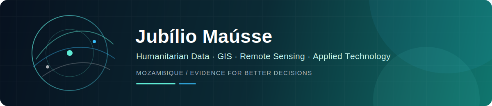

<!-- markdownlint-disable MD033 MD041 -->

  

  <strong>Senior Data and GIS Officer|Analyst · Geospatial Data Scientist · Applied Software Developer</strong>

  Building practical tools and evidence for humanitarian decision-making, geospatial analysis and field data workflows in Mozambique.

  
  
  

---

## About me

I work at the intersection of **humanitarian assessments, geospatial analysis, data science and software development**. As a Senior Assessment Officer with IMPACT Initiatives / REACH in Mozambique, I support the design and implementation of evidence systems that help operational teams understand needs, risks and response priorities.

My work combines field assessment methodologies, KoboToolbox/XLSForm design, data cleaning and analysis, GIS, remote sensing, dashboards and automation. I am especially interested in turning complex technical processes into reliable tools that can be used by field teams, analysts, decision-makers and researchers.

- Based in **Mozambique**
- Background in **Geographic Information Science**
- Working across **humanitarian analysis, WASH, risk monitoring and spatial research**
- Developing open-source tools for **QGIS, Excel, Python and web platforms**

## Areas of focus

| Area | What I work on |
| --- | --- |
| **Humanitarian assessments** | Rapid needs assessments, indicator design, data quality, analysis frameworks and decision-support products |
| **GIS & remote sensing** | Spatial analysis, groundwater potential mapping, environmental risk monitoring and web mapping |
| **Data systems** | KoboToolbox/XLSForm, R and Python workflows, ETL, dashboards and reproducible analysis |
| **Applied software** | QGIS plugins, Excel add-ins, APIs and web applications that solve operational problems |

## Technical toolkit

**Data & analysis:** Python, R, SQL, pandas, tidyverse, survey/srvyr, Excel, Power BI  
**GIS & earth observation:** QGIS, ArcGIS Pro, Google Earth Engine, PostGIS, GeoServer, Leaflet  
**Data collection:** KoboToolbox, ODK, XLSForm, data quality and cleaning workflows  
**Software development:** TypeScript, JavaScript, Java, Spring Boot, FastAPI, React, Angular, Docker  
**Design & communication:** ArcGIS Online, dashboards, Adobe Illustrator, InDesign and technical documentation

## Selected projects

<table>
  <tr>
    <td width="50%" valign="top">
      <h3><a href="https://github.com/Jubilio/xlsform-ai-translator">XLSForm AI Translator</a></h3>
      
Microsoft Excel add-in for translating KoboToolbox and XLSForm questionnaires while preserving variables, formulas, formatting and form logic.

      
<code>TypeScript</code> <code>Office Add-in</code> <code>AI</code> <code>XLSForm</code>

    </td>
    <td width="50%" valign="top">
      <h3><a href="https://github.com/Jubilio/gpx-batch-converter">GPX Batch Converter</a></h3>
      
QGIS plugin for batch-converting field GPS tracks, routes, waypoints and track points into analysis-ready spatial layers.

      
<code>Python</code> <code>PyQGIS</code> <code>Field Data</code> <code>GIS</code>

    </td>
  </tr>
  <tr>
    <td width="50%" valign="top">
      <h3><a href="https://github.com/Jubilio/Risk_Monitoring_Panel">Risk Monitoring Panel</a></h3>
      
Environmental risk monitoring platform for Mozambique using satellite imagery, rainfall data and terrain indicators.

      
<code>Google Earth Engine</code> <code>FastAPI</code> <code>React</code> <code>Remote Sensing</code>

    </td>
    <td width="50%" valign="top">
      <h3><a href="https://github.com/Jubilio/qgis-latlon">QGIS LatLon</a></h3>
      
Lightweight QGIS plugin for capturing map coordinates, identifying source layers and exporting points to common GIS formats.

      
<code>QGIS</code> <code>Python</code> <code>GeoPackage</code> <code>CSV</code>

    </td>
  </tr>
</table>

  <a href="https://github.com/Jubilio?tab=repositories"><strong>Explore all repositories →</strong></a>

## Research and professional interests

- Humanitarian risk analytics and prioritisation
- Groundwater potential mapping using remote sensing and GIS-based multi-criteria analysis
- WASH infrastructure and water-access information systems
- Reproducible data cleaning, analysis and reporting workflows
- Practical AI applications for humanitarian and institutional data management

## Latest videos

Tutorials and demonstrations on GIS, programming, data workflows and applied technology are published on **Deep Geoprogramming**.

<!-- YOUTUBE:START -->
- [XLSForm AI Translator – Translate Kobo/XLSForm Surveys Faster with AI](https://www.youtube.com/watch?v=fkSzCGnISjM) (Jul 22, 2026)
- [Ai machine learning and deep learning explained #coding #chatgpt #windows](https://www.youtube.com/shorts/fKZnJ28EiIg) (Oct 28, 2025)
- [The 3 types of computer vision in ai #smartphone #coding #tech](https://www.youtube.com/shorts/9c3iQlPGWOo) (Oct 28, 2025)
<!-- YOUTUBE:END -->

## Collaboration

I am interested in collaborations involving humanitarian information management, GIS and remote sensing, WASH data systems, applied research and open-source tools for field operations.

  

